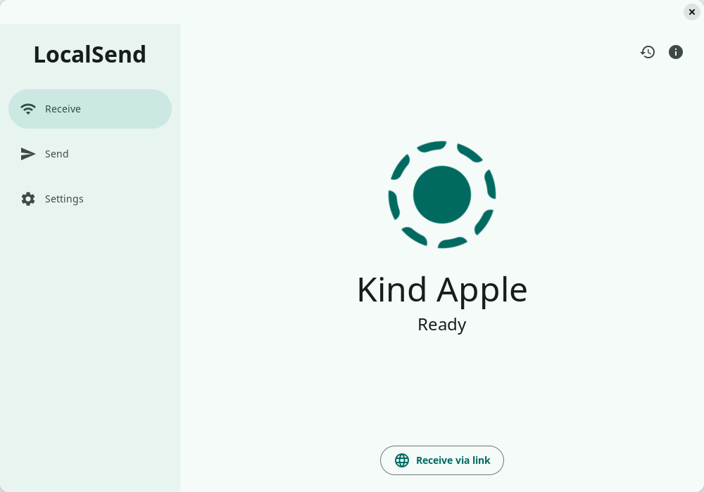
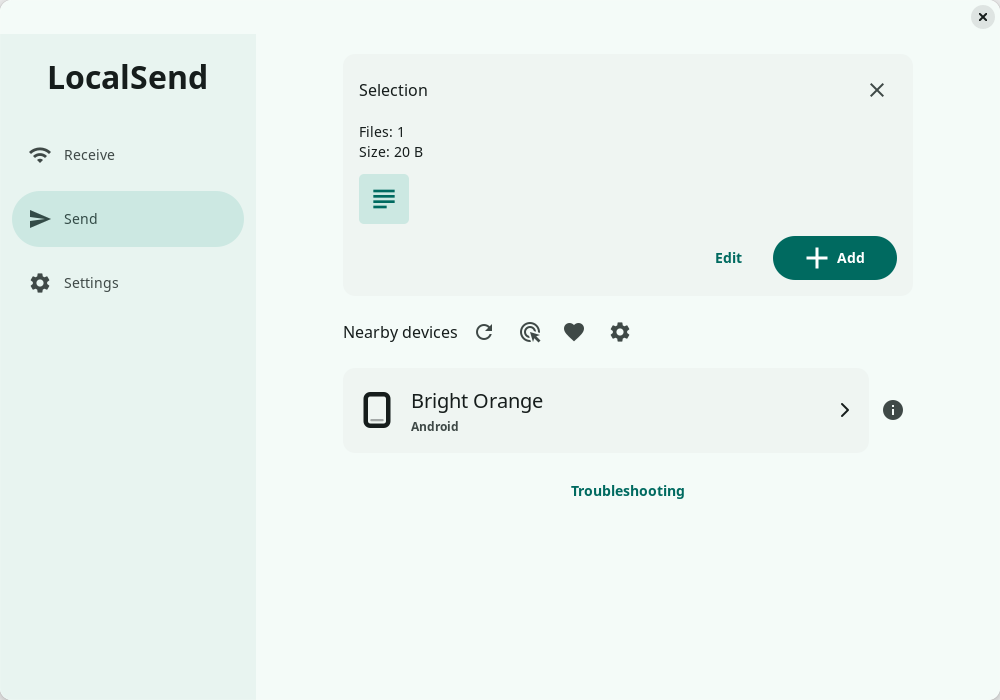
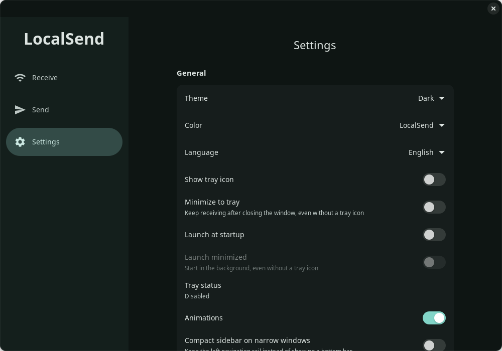

# LocalSend GTK

A community LocalSend client written in Rust with GTK4 and libadwaita, targeting
Linux and Wayland. The interface follows the official [LocalSend](https://github.com/localsend/localsend) desktop layout.
This is an independent client, not an official LocalSend distribution.
The compatibility target is familiarity for existing LocalSend users: familiar
typographic hierarchy, theme roles, terminology, selection workflow and transfer
feedback. Font selection follows the system's Fontconfig configuration; rendering
need not be pixel-for-pixel identical across different toolkits.

## Screenshots

<p align="center">
  
</p>

<p align="center">
  
</p>

<p align="center">
  
</p>

## Implemented

- Receive, Send and Settings views; full sidebar at 800 px, icon rail at 700–799 px,
  and bottom navigation below 700 px, following upstream breakpoints.
- LocalSend teal, OLED black, Yaru, custom and XDG desktop accent palettes with
  system/light/dark appearance. System is offered only when the desktop portal exposes
  an accent and follows later portal changes. Colors are shared by pages, native controls
  and dialogs. Desktop high contrast and reduced motion are respected.
- Material HCT/TonalSpot colors are checked against LocalSend's pinned Dart
  material_color_utilities 0.13.0. Yaru follows its pinned 10.2.0 palette. Fonts are
  neither bundled nor selected by concrete family name: Pango and Fontconfig resolve
  generic sans-serif and language-specific fallback from the system configuration.
- Live English, Simplified Chinese, Traditional Chinese, Japanese, Korean,
  German, French, Spanish and Russian,
  with official terminology and system-selected language fallback. Changing language
  preserves selection, theme choices and active transfers.
- The upstream logo with 15-second rotation (pausing when the receiver stops),
  200 px receive mark, 48 px device name and 24 px visual ID, plus centered 600 px content.
  Short windows use smaller type and artwork; narrow windows use a balanced two-column
  file picker. Notifications leave the receive action and bottom navigation accessible.
- Native GTK file/folder dialogs with Wayland portal integration, recursive folder
  selection, text, clipboard text/files, drag and drop, and individual removal.
- Compact selection thumbnails with Edit/Add, a selection editor with text editing
  and file opening, and automatic continuation when a target is chosen before files.
- HTTPS receiving with per-file Accept/Decline, the official three Quick save modes,
  receive PIN, session and per-file progress, file counts, bytes, speed, elapsed/remaining
  time, cancellation and completed-file opening. Inline messages and links retain
  Copy/Open/Close, and received items can be saved to persistent history.
- History records received files and messages with sender and time. File entries offer
  Open file, Show in folder and Information; individual entries can be removed, and
  Delete history requires confirmation. Removing history leaves received files intact.
- Multicast discovery and HTTP registration responses, using one persisted TLS
  identity for announcing, receiving and sending. Peer announcements update
  existing device cards instead of duplicating them.
- Streaming uploads, preserved file IDs from approval through upload, relative
  folder names, optional recipient PIN, certificate fingerprint checks and a
  client certificate for peers requiring mutual TLS. Peer redirects and proxies
  are disabled for outgoing file transfers.
- Native manual IPv4/IPv6 connections, device details, and saved favorites with
  custom names and pinned identities. Manual discovery also supports mutual TLS. Quick
  save for Favorites trusts only the client certificate authenticated by the HTTPS
  handshake, and adding, editing or removing a favorite takes effect immediately.
- Tap a recipient to send immediately. PIN entry appears only when the recipient
  requests it; rejection, busy and rate-limit responses are distinct.
- Multiple recipients send independently in the background, with per-device progress
  and cancellation. Single-recipient success clears the unchanged selection; multiple
  recipients retain it. Incoming and outgoing progress remain separate.
- Outgoing cancellation uses the official Continue/Cancel confirmation. A confirmation
  applies only to the transfers selected when it opened, leaving later transfers alone.
- Outgoing details show per-file outcomes and byte progress, total accepted bytes,
  average speed, elapsed time and estimated time remaining. Completed files stay
  recorded if a later file fails or the sender cancels.
- Receive via link: temporary browser upload page, QR code, copyable LAN links,
  explicit per-file consent, upload progress and cancellation.
- Share via link: browser downloads of the current file/text selection, QR code,
  native approval, optional auto-accept and concurrent streaming progress.
- Cancel incoming native and browser uploads while keeping the receiver available.
  Completed files are retained; unfinished files are cleaned up before confirmation.
- Optional desktop tray with navigation and Quit, minimize-to-tray and XDG autostart.
  If the desktop has no tray host, the window remains accessible.
- General/Receive/Send/Network settings, live language/theme controls, and receiver
  Start/Restart/Stop with pending-restart feedback. Listener restarts preserve TLS
  identity and stopping revokes browser links and pending offers.
- Persisted device name, theme, language, save folder, port, animations, Quick save,
  Save to history, receive PIN, favorites and send mode. Apply network changes while idle
  without restarting the application.

## Parity status

The app is **not yet fully equivalent** to official LocalSend.
GTK controls and text rendering vary from Flutter Material widgets. Material icons
are bundled to reduce desktop-theme differences. Additional official languages,
official browser-sharing compatibility, media-specific thumbnails and a few advanced
settings still need work. Receiving uses a familiar status card and details dialog,
but does not yet reproduce every Flutter ProgressPage presentation detail, such as its
completion countdown and retry layout. Some low-level error diagnostics remain in
English. Matching palette reference vectors does not by itself prove that every rendered
widget or interaction matches Flutter.

The history and cancellation workflows reference official LocalSend revision
[`f9b0e361052d31a4fddd26c6b4e84310d566d828`](https://github.com/localsend/localsend/commit/f9b0e361052d31a4fddd26c6b4e84310d566d828). Typography and theme comparisons retain
revision [`033d97511d1980db5283914f8a726f74d5fb7c17`](https://github.com/localsend/localsend/commit/033d97511d1980db5283914f8a726f74d5fb7c17) and its pinned theme packages.
No claim of full interoperability with every official version is made: the
included integration tests use a real localhost HTTPS receiver and a mutual-TLS
peer, rather than physical Android/iOS devices.

## Build and run

Requires current stable Rust, GTK **4.12+**, libadwaita **1.5+**, pkg-config and a C
compiler. The protocol dependency is pinned to a fixed revision in Cargo.toml,
with the source from [`localsend-rs` PR #4](https://github.com/CrossCopy/localsend-rs/pull/4) (upstream repository: [`CrossCopy/localsend-rs`](https://github.com/CrossCopy/localsend-rs)) plus documented local cancellation and
authenticated-receiver patches in `vendor/localsend-rs/UPSTREAM.md`.

Ubuntu 24.04:

```sh
sudo apt install build-essential pkg-config libgtk-4-dev libadwaita-1-dev libssl-dev
cargo run --locked
```

Fedora:

```sh
sudo dnf install gcc pkgconf-pkg-config gtk4-devel libadwaita-devel openssl-devel
cargo run --locked
```

For an optimized build, use `cargo build --release --locked`.

No particular font family is required. Install fonts covering the languages you
use, including CJK coverage when needed; Fontconfig controls family matching and
fallback. The app retains its own text sizes and weights for the familiar layout.

### Release packages

Release packages are native Linux builds and require compatible system GTK4 and
libadwaita libraries; the tar archive does not bundle them. On Ubuntu 24.04, install
`binutils dpkg-dev rpm desktop-file-utils python3` in addition to the build
dependencies above, then run:

```sh
cargo install cargo-generate-rpm --version 0.21.0 --locked
bash scripts/package-release.sh
```

The script rebuilds the current source, produces DEB, RPM and tar.gz packages in
`target/dist`, and writes `SHA256SUMS`. It stops if any package cannot be produced.
Versioned tags must match Cargo.toml, Cargo.lock and the RPM spec. Release notes
for this update are in [docs/releases/v0.1.0.md](docs/releases/v0.1.0.md).

All three packages include the application launcher and Dolphin's **Send with
LocalSend** menu for local files and folders (KDE Frameworks 5.85 or newer).
For the tar archive, run `sudo ./install.sh` to install under `/usr/local`, or
`./install.sh "$HOME/.local"` for the current user. A custom prefix is also supported;
its `share` directory must be on the desktop session's XDG data search path for
the launcher and Dolphin menu to appear. The installer writes absolute executable
and icon paths, so launching does not depend on adding its `bin` directory to `PATH`.

Package recipes are also provided for Arch Linux (`packaging/aur`) and Flatpak (`packaging/flatpak`), though they are not published to official repositories.

Packages also include a **Send with LocalSend** script for local files and folders
in GNOME Files (Nautilus). Nautilus discovers scripts only in
`${XDG_DATA_HOME:-$HOME/.local/share}/nautilus/scripts`, not system XDG data paths.
The tar installer enables it automatically when installing under `$HOME/.local`.
After installing the DEB or RPM, enable it for your account with:

```sh
mkdir -p "${XDG_DATA_HOME:-$HOME/.local/share}/nautilus/scripts"
ln -s "/usr/share/nautilus-scripts/Send with LocalSend" \
    "${XDG_DATA_HOME:-$HOME/.local/share}/nautilus/scripts/Send with LocalSend"
```

For a tar installation elsewhere, replace `/usr/share` above with the installation
prefix's `share` directory (for example, `/usr/local/share`). Right-click selected
local files or folders and choose **Scripts → Send with LocalSend**. System
packages do not modify individual users' script directories.

On a Wayland session the application selects the Wayland backend automatically,
unless `GDK_BACKEND` was explicitly set. To require Wayland:

```sh
GDK_BACKEND=wayland cargo run --locked
```

GTK handles compositor scaling, clipboard, drag and drop, and window placement.
Install `xdg-desktop-portal` and the appropriate GTK/GNOME/KDE/wlr portal backend
for native file dialogs. This client does not call X11 APIs; your distribution's
GTK library may still link X11 support. The window's Wayland app ID is
`org.localsend.localsend_gtk`.

Allow local TCP and UDP traffic on port **53317**. WSL may not pass LAN multicast
through its virtual network; use a native Linux session for discovery testing
with physical devices. The local test suite does not change firewall rules.

Browser receiving uses a separate, temporary HTTP listener on a random TCP port.
Its random link is valid only while the Receive via link dialog is open. Browser
uploads are **unencrypted** and always require approval, even with Quick save or
a native receive PIN. Share the link only on a trusted LAN. Each upload is streamed
to a temporary file and published without replacing existing files; offers are
limited to 512 files and 100 GiB. This is a native client browser feature, not a
claim of compatibility with the official app's browser-sharing protocol.

Share via link is available in the Send mode menu after selecting files or text.
It also uses a temporary random HTTP port and a private link. Browser downloads
require approval by default; enabling Auto accept lets anyone with the link access
the selection. Changing this option affects future requests. Closing the dialog
revokes the link, pending approvals and active streams. Bytes already delivered
to a browser cannot be revoked. Progress reports bytes served; check the browser's
download list for successful saving. Files are read from their original open handles;
symlinks are refused and detected file changes end a download.

## Settings and shortcuts

Configuration and history are stored in `$XDG_CONFIG_HOME/localsend-gtk`
(normally `~/.config/localsend-gtk`). `identity.json` contains the private TLS
identity and is created with mode 0600. Do not share it. Settings are written
atomically; malformed settings are reported without overwriting the file.

Save to history is enabled by default under Settings → Receive. History stores received
file metadata and the full text of received messages. Turning it off stops recording new
receipts and keeps existing entries. Earlier plain-text history entries are preserved
when loaded; their missing file paths and sender details are not guessed. If saved history
cannot be read, the app leaves it untouched and keeps new receipts only for the current
session. Deleting an entry or clearing history never deletes a received file.

- `Ctrl+1`, `Ctrl+2`, `Ctrl+3`: Receive, Send, Settings.
- `Ctrl+O`: select files.
- `Ctrl+V` on the Send view: paste text or files.

Quick save for Favorites is enabled by default, matching the official three-state
Off / On / Favorites behavior. Favorites are matched by the certificate presented and
verified during the HTTPS handshake; HTTP, missing or mismatched certificates require
approval. The global Quick save option accepts file requests from every device. Inline
messages always require an explicit action in every mode.
Folder selection skips symlinks to avoid cycles and files outside the selected
folder. Empty directories are not transmitted.

Manual addresses accept full IPv4 or IPv6 literals (hashtag `#` shortcut lookup has been removed).

Tray integration uses the StatusNotifierItem desktop interface. Show tray icon
and Minimize to tray are independent settings: closing can keep the receiver in
the background even when the desktop has no tray host. Launch at startup writes
an application-owned desktop entry under `$XDG_CONFIG_HOME/autostart`. Launch
minimized uses `--hidden`; `--background` also starts without showing the window.
Launch the application again to show the existing window. All these settings
default to off.

Use Settings → Network → Restart after changing the device name, port,
receive PIN or destination. Applying is refused during active transfers and closes
any idle browser link. If the replacement listener fails to start, the previous
listener is restored and the error is shown; correct the saved draft and apply again.

## Validation

The automated suite covers history, outgoing and incoming cancellation, authenticated
favorite Quick save, X.509 identity checks, multi-file session/per-file progress and
14 browser tests, alongside formatting and warning-free Clippy checks. The separate
Wayland interaction fixture runs in standard and high-contrast modes, including history
and receiving details at 360×540, live language changes, and cancellation confirmations
for replaced sessions. The latest local run passed 105 application tests (2 environment
tests run separately), 175 vendored protocol tests (1 external-network test ignored), all
14 browser tests, isolated tray interactions, and both Wayland modes. Real desktop file-manager and GNOME/KDE portal
integration still needs hands-on verification.

```sh
cargo fmt --all -- --check
cargo clippy --locked --all-targets -- -D warnings
cargo test --locked
node scripts/test-browser.cjs
node --test scripts/test-web-share.cjs
dbus-run-session -- env LOCALSEND_TRAY_TEST_BUS=1 cargo test --locked tray_private_bus_registers_activates_recovers_and_unregisters -- --ignored --test-threads=1 --nocapture
```

For actual GTK rendering on a private headless Wayland compositor:

```sh
sudo apt install weston dbus-x11 fonts-noto-core
bash scripts/test-wayland.sh
ADW_DEBUG_HIGH_CONTRAST=1 LOCALSEND_SCREENSHOT_DIR=target/screenshots-high-contrast bash scripts/test-wayland.sh
cargo build --locked
bash scripts/test-wayland.sh python3 scripts/test-file-open.py
```

The visual test verifies selection editing and continuation, device deduplication,
independent recipient progress/cancellation, success clearing, native dialogs,
browser QR rendering and consent, receive cancellation,
multi-file receive details and desktop setting controls. It opens all three views,
switches dark/light/OLED,
Yaru and custom appearance, checks invalid custom-color input, and exercises desktop,
compact, narrow and 360×540 layouts. It also checks that notifications cannot intercept
the receive action. An isolated D-Bus
test exercises tray registration, activation, host loss/recovery and cleanup.
The file-open check launches the application with temporary settings to test cold
startup, file forwarding to the existing instance, and invalid-settings feedback.
Screenshots are saved under `target/screenshots`; override with
`LOCALSEND_SCREENSHOT_DIR`. Test fixtures never announce fake peers on the LAN or
write to the user's settings. CI runs both the protocol and Wayland checks.
The browser script checks use Node 18+ with built-in modules only; Node is not
required to build or run the native app.

## Licensing

The project is MIT licensed; see `LICENSE`. The upstream [LocalSend](https://github.com/localsend/localsend) logo is Apache-2.0;
see [THIRD_PARTY_NOTICES.md](THIRD_PARTY_NOTICES.md) and [LICENSES/LocalSend-Apache-2.0.txt](LICENSES/LocalSend-Apache-2.0.txt).
